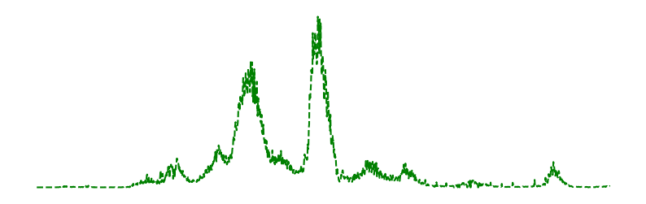

# **Daily Covid-19 Report**
[](https://github.com/yapkhaichuen/Daily-Covid-Report/actions/workflows/generate-report.yml)


Generates a simple report about the current Covid-19 cases and deaths in Malaysia.
Results are delayed one day, data provided by 
the Ministry of Health Malaysia Covid-19 public data.

1. data.json file for report output
2. report output is generated every 30 minutes

Data from: <br>
[MoH-Malaysia Covid-19 Public Data](https://github.com/MoH-Malaysia/covid19-public)

View deployment here: <br>
[GitHub Pages](https://yapkhaichuen.github.io/Daily-Covid-Report/)

For Apple devices compatible with Shortcuts: <br>
[Covid-19 information Apple Shortcut](https://www.icloud.com/shortcuts/77bf8a1a406e437fa939d172f28f987b)

## **Raw data**
<!-- MARKDOWN-AUTO-DOCS:START (CODE:src=https://raw.githubusercontent.com/yapkhaichuen/daily-covid-report/main/data.json) -->
<!-- The below code snippet is automatically added from https://raw.githubusercontent.com/yapkhaichuen/daily-covid-report/main/data.json -->
```json
[
    {
        "country": "Malaysia",
        "last updated": "2022-02-15",
        "cases": 22133,
        "deaths": 31,
        "recovery": 7584,
        "generated": "2022-02-16 19:13:00.820492+08:00"
    }
]
```
<!-- MARKDOWN-AUTO-DOCS:END -->
## **Generated report**
<!-- MARKDOWN-AUTO-DOCS:START (JSON_TO_HTML_TABLE:src=./data.json) -->
<table class="JSON-TO-HTML-TABLE"><thead><tr><th class="country-th">country</th><th class="last-updated-th">last updated</th><th class="cases-th">cases</th><th class="deaths-th">deaths</th><th class="recovery-th">recovery</th><th class="generated-th">generated</th></tr></thead><tbody ><tr ><td class="country-td td_text">Malaysia</td><td class="last-updated-td td_text">2022-02-15</td><td class="cases-td td_num">22133</td><td class="deaths-td td_num">31</td><td class="recovery-td td_num">7584</td><td class="generated-td td_text">2022-02-16 19:13:00.820492+08:00</td></tr></tbody></table>
<!-- MARKDOWN-AUTO-DOCS:END -->

## **Cases Graph**


## **Deaths Graph**


## **Recovery Graph**



