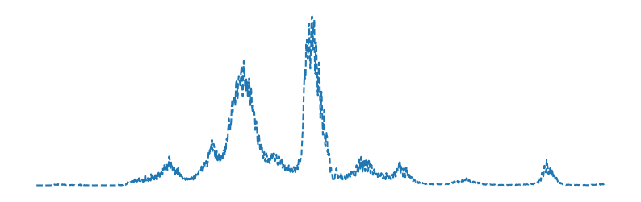

# **Daily Covid-19 Report**
[](https://github.com/yapkhaichuen/Daily-Covid-Report/actions/workflows/generate-report.yml)


Generates a simple report about the current Covid-19 cases and deaths in Malaysia.
Results are delayed one day, data provided by 
the Ministry of Health Malaysia Covid-19 public data.

1. data.json file for report output
2. report output is generated every 30 minutes

Data from: <br>
[MoH-Malaysia Covid-19 Public Data](https://github.com/MoH-Malaysia/covid19-public)

View deployment here: <br>
[GitHub Pages](https://yapkhaichuen.github.io/Daily-Covid-Report/)

## **Raw data**
<!-- MARKDOWN-AUTO-DOCS:START (CODE:src=https://raw.githubusercontent.com/yapkhaichuen/daily-covid-report/main/data.json) -->
<!-- The below code snippet is automatically added from https://raw.githubusercontent.com/yapkhaichuen/daily-covid-report/main/data.json -->
```json
[
    {
        "Country": "Malaysia",
        "Last updated": "2022-01-30",
        "Cases": 4915,
        "Deaths": 8,
        "Generated": "2022-01-31 18:15:55.391381+08:00"
    }
]
```
<!-- MARKDOWN-AUTO-DOCS:END -->
## **Generated report**
<!-- MARKDOWN-AUTO-DOCS:START (JSON_TO_HTML_TABLE:src=./data.json) -->
<table class="JSON-TO-HTML-TABLE"><thead><tr><th class="country-th">Country</th><th class="last-updated-th">Last updated</th><th class="cases-th">Cases</th><th class="deaths-th">Deaths</th><th class="generated-th">Generated</th></tr></thead><tbody ><tr ><td class="country-td td_text">Malaysia</td><td class="last-updated-td td_text">2022-01-30</td><td class="cases-td td_num">4915</td><td class="deaths-td td_num">8</td><td class="generated-td td_text">2022-01-31 18:15:55.391381+08:00</td></tr></tbody></table>
<!-- MARKDOWN-AUTO-DOCS:END -->

## **Cases Graph**


## **Deaths Graph**


